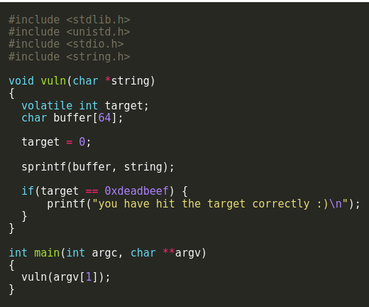

# format0

in this challenge we are given again a 64 byte buffer which the program use ```sprintf()``` in order to copy the user input into the buffer.



for modifying target we would to overflow the buffer using ```sprintf()``` since no size is given to function it would write how much we give into the buffer causing an overflow.

for that we can just print using python to ```print "'%64d' + '\xef\xbe\xad\xde'"``` , ```%64d``` fills the buffer with a random integer from the stack in the width of 64 bytes and then we add our raw bytes to overflow ```targer``` causing an overflow and changing the varriable.