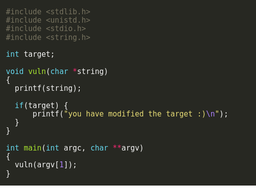

# format1

in this challenge we are given a ```printf()``` command which print the user input value and we need to overwrite a global varriable located in the program.



First we would need to find the address of our ```target``` varriable in order to write to it,for that we user ```objdump -t format0``` and we can see that ```target``` is at ```08049638```.

Next we would need to set our target address as a read/argument for ```printf()```, in that case we would use ```%x``` to read each time until we get to out input we given it.
After playing with it and finding the correct times of read i used ```%n``` in order to write to the address value we given it the number of bytes so far so we changed the value of target.

```./format1 "$(python -c 'print("\x38\x96\x04\x08" + "%x "*126 + "%n")')"```