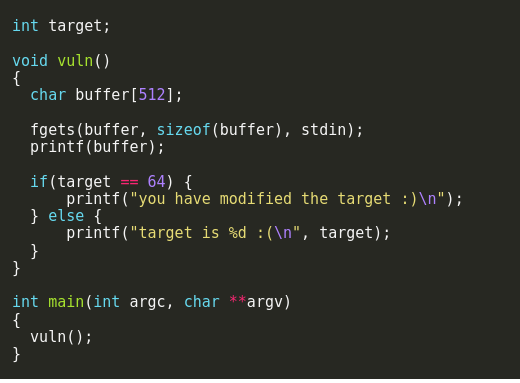

# format2 

In this challenge is again same like the last one but now we are writing it safaly into a buffer of 512 bytes then using ```printf()``` to print what inside it,with that we need to overwrite ```target``` to have the value 64.



First like last time we would need to find ```target``` address in memory using ```objdump -t format2``` we found the address at ```080496e4``` then using again ```%x``` to read arguments for ```printf()``` we got that we need to read 3 times and then read and write bytes so far using ```%n```, then adding some padding until we hit 64 bytes so far we got the success message.

```python -c 'print("\xe4\x96\x04\x08" + "a"*41 + "%x"*3 + "%n")' | ./format2```