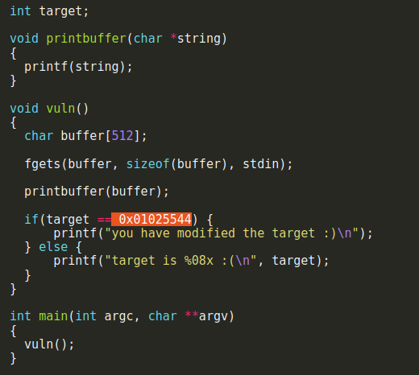

# format3

in this challenge we are given the same as foramt2 but this time we need to overwrite ```target``` an address not just a number.



For that once again we need to find the address of ```target``` in memory using ```objdump -t format3``` we found the address in ```080496f4```,now we need to write to that address the value  ```0x01025544```.
for that we overwrite each time one byte of the address meaning we would overwrite first ```080496f4``` then ```080496f5``` and so on...

## Creating the paylod

Our 4 address in total is 16 bytes,for the first address we need to write ```0x44``` which in decimal is 68,therefore 68 - 16 is 52 makes us the first.
Second is ```0x55``` in decimal 85,so we do 85 - 68 is 17 more chars.
Third and fourth are decimal 2 and 1 which are smaller then 85 and 68 for that we use ```%hhn``` which instead of writing 4 bytes/word like ```%n``` it writes only 1 byte at the addres because of that it can only write untill 255 length in decimal and each padding after would wrap the counter making it come back to one meaning we need to get to 257 to write 2 at the third address and then wrap it again for the fourth address which is 1.

using ```%12$hhn``` 12 stand for the index of the argument in the stack for this case the first address was in index 12

so it would look like this 

```python -c 'print "\xf4\x96\x04\x08\xf5\x96\x04\x08\xf6\x96\x04\x08\xf7\x96\x04\x08" + "%52x%12$hhn" + "%17x%13$hhn" + "%173x%14$hhn" + "%255x%15$hhn"' | ./format3``` 

here you can see how i use the wrapping technique.