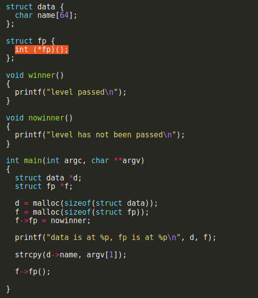

# heap0

In this challenge we are given 2 structs which are allocated in the heap one of them is ```data``` the other is ```fp```.
```Data``` has 1 member which is a 64 byte buffer string and ```fp``` has an int ptr member.



# Crafting the payload

So in order to get to ```winner``` we would first need to find its address using ```objdump -t ./heap0``` we find the address at ```08048464``` now after the program allocates both structs into the heap it strcpy user input into the member ```name``` which is a 64 byte buffer, now to overwrite the ptr in `fp` we would need to padd 72 bytes until our address because the buffer is 64 bytes + 8 bytes of block header then comes the member ptr to the function.

so we can run `./heap0 $(python -c 'print "A"*72 + "\x64\x84\x04\x08"')` to change the control flow.