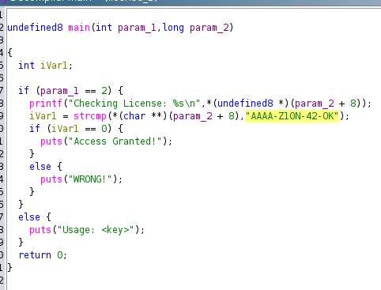
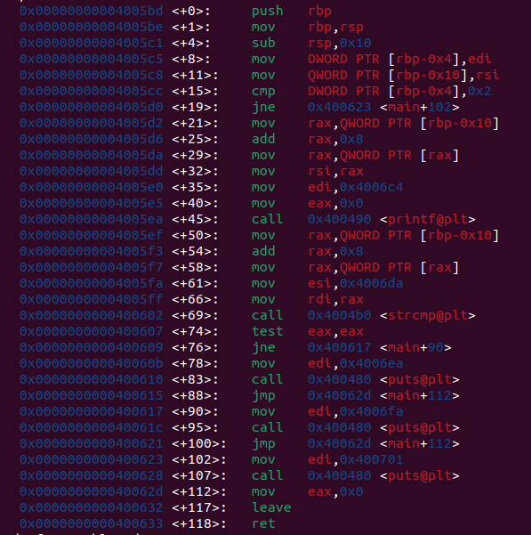

# License Crackme

## Static analysis

After opening the binary in Ghidra, we can see that the program takes a string as input and uses `strcmp` to verify whether the password is correct.

## Dynamic analysis

Another way to crack the program is by debugging it with GDB.

Right before the branch that leads to **"Access granted!"**, the program executes `test eax, eax`.

Since `strcmp` returns `0` when the two strings match, forcing `eax = 0` at this point will redirect execution into the success path.