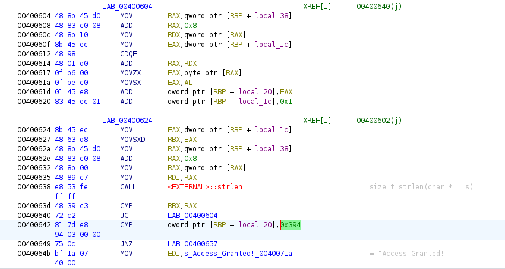

# Licsense2

## Static analysis

opening the program in ghidra we can see that it is now have a new way of generating a key.

we can see that the program create a loop where it irtates one byte at a time of the user inputed key and sums each byte value of that key into one varriable where in the end it checks if it is 0x394h or 916 for that we can use a python script which takes ascii chars combine their byte values until it gets a 916.
