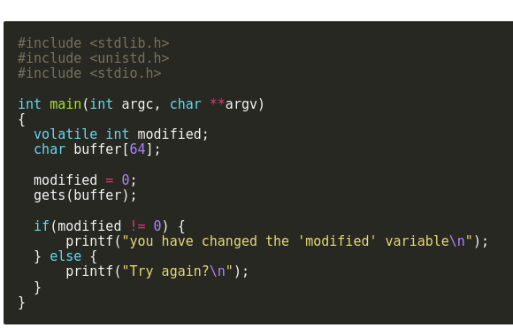

# Stack0 challenge

running the program we can see it takes an argument from the source code we can see the arguments is places into a buffer of 64 bytes in size.

providing the program with a string more then 64 bytes will change the value of modified from 0 to what we overwritten.
