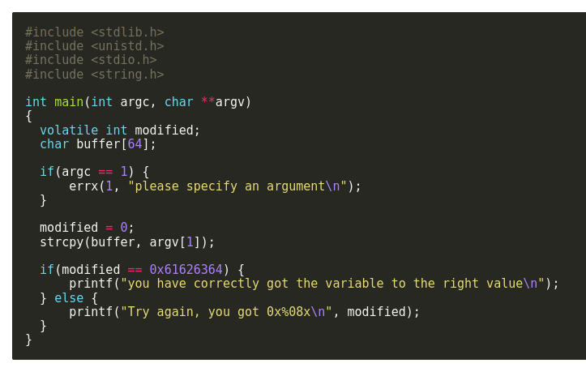

# stack1

looking at the source code we have almost the same case as the last one where we have a buffer with a 64 byte size and the program copies the argument into the buffer then checks if we overflowed the buffer and change the modified varriable.

with a string such "1111111111111111111111111111111111111111111111111111111111111111abcd" we can modify the varriable to 0x61626364