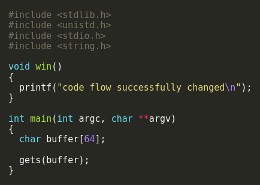
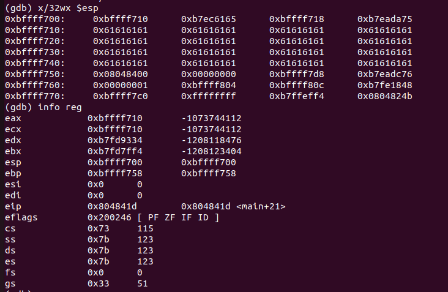
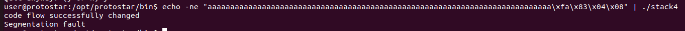

# Stack4

in this program we have again a 64 bytes buffer which the user input copied into that buffer.
The main goal of the challenge is to control the flow of the program by getting to the function ```win()```



for that we would need to stack buffer overflow in order to overwrite the return address to point to ```win()```.
first understanding where ```win()``` lies we can do by using ```gdb``` and breaking at ```win()``` we can see that ```win()``` lies at ```0x80483fa```. 
then we need to understand how the stack looks like and where is our return address located in the stack,For that we use ```gdb``` to print the stack mid run.



First we can see that our buffer is located at ```0xbffff710``` then we want to see where ```ebp``` pointing to which is ```0xbffff758```we want that because when we ```POP ebp``` esp will point to ```0xbffff75C``` and that where our return address is located. 
for building the payload we need to understand how much padding we need so if we ```0xbffff75C - 0xbffff710``` we get 76 decimal meaning we need a padding of 76 bytes, so our payload would look like that ```payload = a*76 + \xfa\x83\x04\x08```



or just pipe into the binary like that ```echo -ne "aaaaaaaaaaaaaaaaaaaaaaaaaaaaaaaaaaaaaaaaaaaaaaaaaaaaaaaaaaaaaaaaaaaaaaaaaaaa\xfa\x83\x04\x08" | ./stack4```