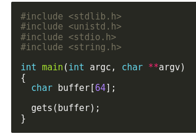
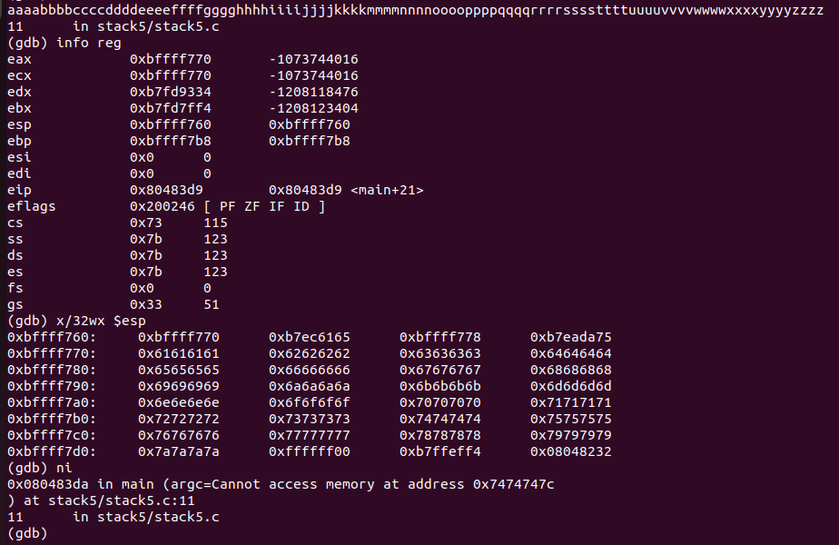
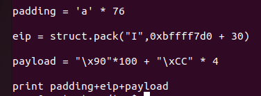

# Stack5

in this program we are given a 64 byte buffer and need to control the code flow in order to execute our written code.



First like the last challenge we first need our return address to overwrite it to land in our ```NOP_SLED``` for that we use ```gdb``` and break on the ret instruction finding that the return address is located at ```0xbffff7b0``` at the stack,and our buffer start at ```0xbffff770``` 



So our payload will look like this.



```/xCC``` is a one byte opcode used for debugging creating a debugging trap.

