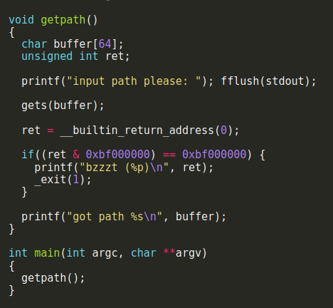
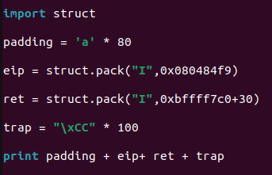
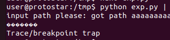

# Stack6

in this challenge we have again a 64 byte buffer and we need to execute our own code using a stack buffer overflow.



Here we can see a new kind of "Firewall" where the program doesnt let us use a return address that is inside the stack.
So what we do is first returning to the same return address the function use ```0x080484f9``` so what will happen is that

```0x080484f9```
```0xbffff7c0```
```TRAP```

so first since we hit ```0x080484f9``` will pop it out of the stack so eip will point next to ```0xbffff7c0``` then after that eip will point to our shellcode/Trap.



Code executing


